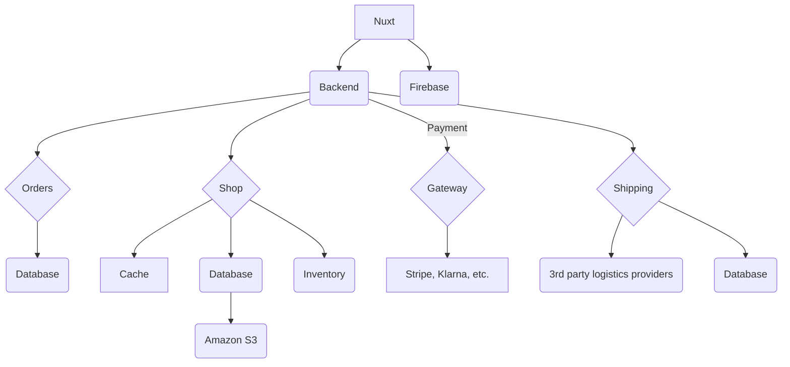
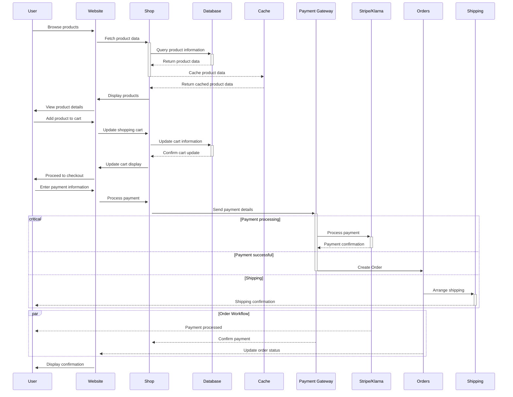
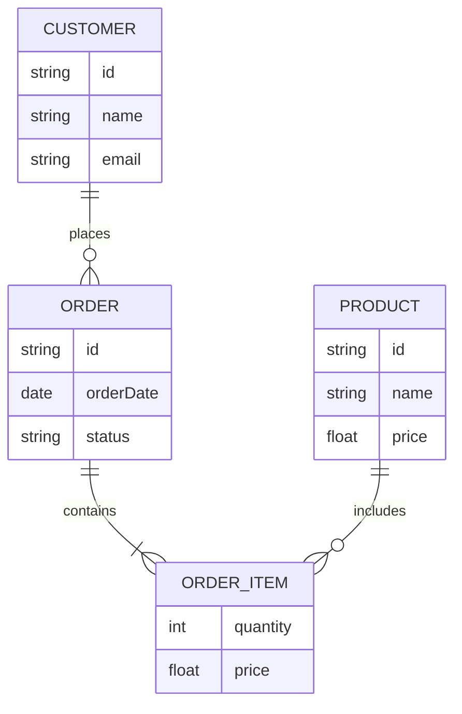

# YouTube Fullstack Architecture

## Requirements & Assumptions 🟠

### Clarifying Questions

*Questions that need to be answered to better understand the requirements and constraints of the system*

---

### Functional Requirements 🟢

*Describes the specific features and functionalities that the system must provide*

---

## Capacity Planning ⏰

### Database

### Storage

---

## High Level Architecture 🏗️

*Describes the overall structure of the system, including the main components and how they interact with each other. This can be illustrated using diagrams such as component diagrams or architecture diagrams.*

---

## System Workflow 🔄

*Explains the sequence of interactions between different components of the system, such as how a user request flows through the application, how data is processed, and how responses are generated. This can be illustrated using sequence diagrams or flowcharts.*

---

## Api Design 🛠️

*Describes the design of the APIs that will be used for communication between different components of the system, such as the frontend and backend. This includes the endpoints, request and response formats, authentication mechanisms, and any other relevant details about how the APIs will function.*

> Determines also whether the system will be using RESTful APIs or GraphQL, and how the frontend will interact with these APIs to fetch and manipulate data.
> If the system uses microservices architecture, the API design will also include details about how different microservices will communicate with each other, such as using RESTful APIs, gRPC, or message queues.

| Endpoint | Method | Description                 | Request Body                         | Response Body                 |
| -------- | ------ | --------------------------- | ------------------------------------ | ----------------------------- |
| /graphql | POST   | Retrieve a list of products | { query: string, variables: object } | List of products with details |

---

## Data storage

*Describes how the system will store and manage data, including the choice of database (e.g., relational, NoSQL), data models, and how data will be accessed and manipulated by the application.*

### Amazon S3

*Explains the the manner in which the system will use Amazon S3 for storing and retrieving files, including the structure of the S3 buckets, access control policies, and how the application will interact with S3 for file uploads and downloads.*

### Database

*Explains the choice of database (e.g., relational, NoSQL) and how it will be used to store and manage data for the application. This includes the data models, relationships between entities, and how the application will perform CRUD (Create, Read, Update, Delete) operations on the database.*

## Caching

*Describes the caching strategy for the application, including what data will be cached, how it will be cached (e.g., in-memory cache, distributed cache), and how the cache will be invalidated when data changes. For example, product data that is frequently accessed but infrequently updated can be cached to improve performance and reduce load on the database.*

## Scalability

*Describes how the system will be designed to handle increasing loads and scale as needed. This includes strategies for horizontal scaling (adding more servers) and vertical scaling (upgrading existing servers), as well as any load balancing techniques that will be used to distribute traffic across multiple servers.*

---

## References ⏰

*List of services and components that will be part of the system, along with their respective technologies and descriptions. This can be presented in a tabular format for clarity.*

| Service            | Language/Framework | Description                           |
| ------------------ | ------------------ | ------------------------------------- |
| Cart               | Django             | Manages shopping cart functionalities |
| Reviews            | Django             | Handles product reviews and ratings   |
| Shop               | Django             | Manages product catalog and inventory |
| Frontend           | Nuxt 4             | Renders the desktop user interface    |
| Frontend Admin     | Nuxt 4             | User-friendly admin interface         |
| Frontend Mobile    | Nuxt 4 + Ionic     | Mobile-friendly interface             |
| Flutter            | Flutter            | Mobile-friendly interface             |
| Purchase Gateway   | Golang             | Managing Stripe payments              |
| Auth Load-Balancer | Golang             | User authentication and authorization |
| Cart               | Django             | Cart management                       |
| Subscribers        | Django             | Newsletters etc. management           |

## Technologies Used 🌳

*List of the main technologies used in the system, along with their purpose and version. This can help in understanding the technical stack of the application and how different components are implemented.*

| Technology        | Purpose/Usage                | Version |
| ----------------- | ---------------------------- | ------- |
| Django            | Web framework                | ✅ 6.X  |
| PostgreSQL        | Database                     | ✅ 13.X |
| Redis             | Caching, message broker      | ✅ -    |
| RabbitMQ          | Message broker               | ✅ -    |
| Docker            | Containerization             | ✅ 20.X |
| Nuxt 4            | Frontend framework           | ✅ 4.X  |
| Ionic             | Mobile application framework | ✅ 7.X  |
| Firebase          | Authentication, database     | ✅ -    |
| AWS S3            | Static and media storage     | ✅ -    |
| Cloudfront        | CDN for static files         | ✅ -    |
| Google Analytics  | Traffic analysis             | ✅ -    |
| Facebook Pixels   | Traffic analysis             | ✅ -    |
| Microsoft Clarity | Traffic analysis             | ✅ -    |
